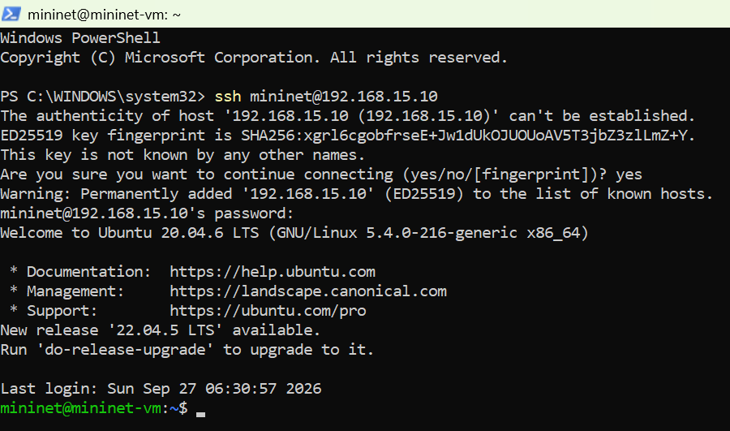
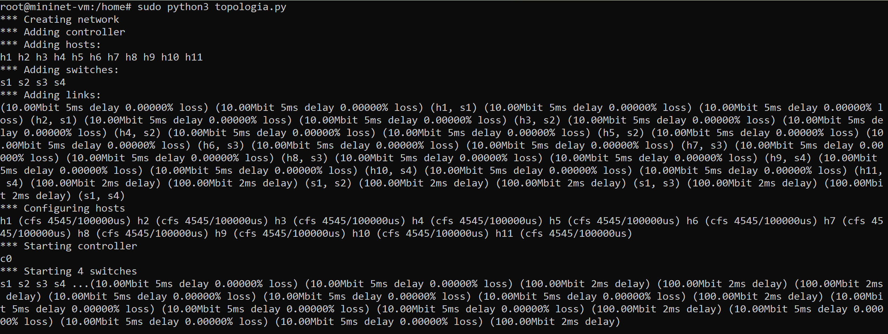
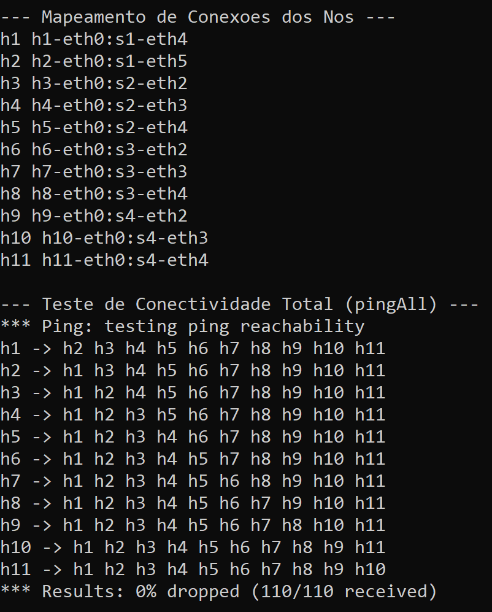
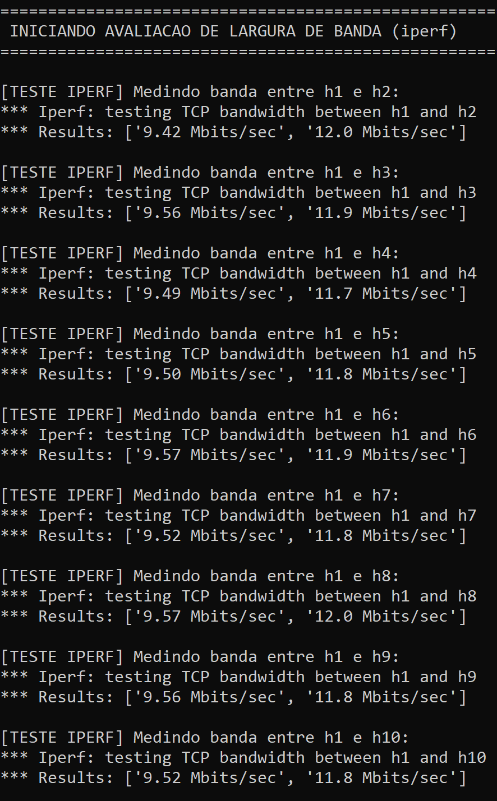

## ETAPA 1: Criar o Script da Topologia Customizada 

O arquivo de topologia foi criado com 4 switches e 11 hosts, com limitação de banda, atraso e desabilitação de IPv6 e está em: https://github.com/marcioclay/Mestrado_mininet_ryu/blob/main/topologia.py.

## ETAPA 2: Executar a Topologia e Coletar os Resultados do Mininet

Validar a conectividade entre todos os 11 hosts com pingall e medir a largura de banda com todos os outros hosts (iperf).

Obs. caso esteja realizando o teste mais de uma vez é é boa prática executar comando de limpeza para garantir que nenhuma emulação anterior ficou presa na memória:

```
sudo mn -c
```

1. Executar o Script da Topologia

```
 sudo python3 topologia.py
```

2. Observações

   - Mapeamento de Conexões: O comando dumpNodeConnections exibirá a lista de qual porta de cada switch está ligada a qual host.
   - Teste de Ping (pingAll): O Mininet testará a comunicação de todos para todos. A resposta final deve indicar 0% dropped (0% de perda), confirmando que a rede está 100% funcional.
   - Teste de Largura de Banda (iperf): O script executará o iperf medindo a velocidade entre h1 e h2, depois h1 e h3, até o h11.
       * A taxa obtida ficará em torno de 9.5 Mbits/sec a 9.8 Mbits/sec, o que reflete exatamente o limite de $10\text{ Mbps}$ configurado nos enlaces de acesso com o overhead do protocolo TCP.
    
3. Imagens coletadas

 ---- ## 📸 Demonstração Prática e Resultados (Etapa 2)

### 1. Acesso Remoto à Máquina Virtual via SSH
Conexão efetuada através do Windows PowerShell para a máquina virtual do Mininet (`mininet@192.168.15.10`), garantindo o suporte adequado ao ambiente de linha de comandos.



---

### 2. Inicialização e Construção da Topologia Customizada
Execução do script Python (`topologia.py`), criando com sucesso a infraestrutura com **11 hosts** (`h1` a `h11`), **4 switches OpenFlow** (`s1` a `s4`), controlador local por omissão (`c0`) e enlaces configurados com restrições de largura de banda e atraso (`TCLink`).



---

### 3. Mapeamento de Interfaces e Teste de Conectividade (`pingAll`)
Exibição do mapeamento físico das portas de cada switch ligado aos respetivos hosts e verificação da comunicação total da rede.
* **Resultado do Ping:** `0% dropped (110/110 received)`, confirmando comutação de Layer 2 totalmente funcional entre todos os nós.



---

### 4. Avaliação de Largura de Banda (`iperf`)
Medição da taxa de transferência TCP entre o host `h1` e todos os restantes hosts da rede (`h2` a `h11`).
* **Resultado:** Vazão útil média constante entre **9.42 Mbits/sec** e **9.57 Mbits/sec**, perfeitamente alinhada com o limite teórico de $10\text{ Mbps}$ estipulado nos enlaces de acesso, considerando o *overhead* dos cabeçalhos das camadas TCP/IP.


