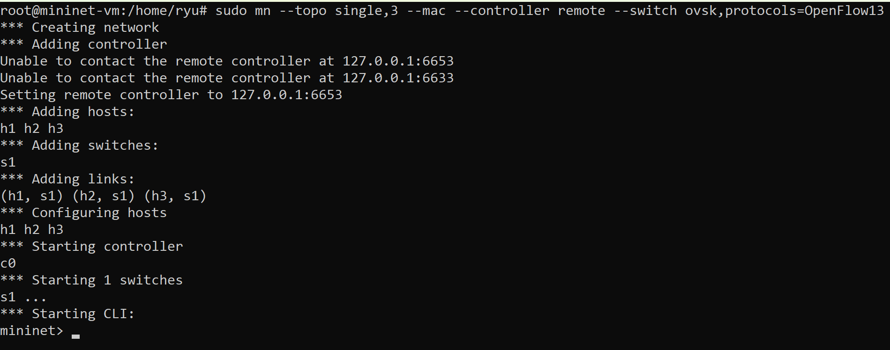
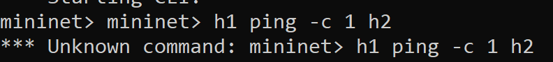

## 🛠️ Etapa 3: Instalação do Ryu e Teste do OpenFlow 1.3 sem Controlador

### 1. Instalação do Controlador Ryu

Atualização do ambiente e instalação do controlador SDN Ryu a partir do repositório oficial[cite: 5, 13]:

```bash
sudo apt update
python3 -m pip install --upgrade pip
git clone [https://github.com/osrg/ryu.git](https://github.com/osrg/ryu.git)
cd ryu
pip install .

```

### 2. Inicialização da Topologia com OpenFlow 1.3

Inicialização do ambiente de emulação no Mininet com 1 switch e 3 hosts, configurado para utilizar a versão OpenFlow 1.3 e comunicar com um controlador remoto:

```
sudo mn --topo single,3 --mac --controller remote --switch ovsk,protocols=OpenFlow13
```


### 3. Teste de Comunicação sem Controlador Ativo

Verificação da conectividade entre os hosts h1 e h2 através do comando ping no terminal do Mininet:
```
mininet> h1 ping -c 1 h2
```
Perda 100%, pois o controlador não foi iniciado e não preencheu a tabela de fluxos.

 


### 4. Ativar controlador ryu

```
ryu-manager --verbose ryu.app.simple_switch_13
```


### 5. Handshake Inicial (Ryu + Switch)

- OFPT_HELLO 
  Direção: Enviado por ambos (Switch $\leftrightarrow$ Controlador).
  Descrição: Primeira mensagem trocada no canal de controle. Utilizada para negociar a maior versão do protocolo suportada por ambas as partes (versão OpenFlow 1.3, identificada como 0x04).

- OFPT_FEATURES_REQUEST
  Direção: Controlador $\rightarrow$ Switch.
  Descrição: O controlador consulta as capacidades do hardware do switch, solicitando informações sobre portas, buffers e tabelas de fluxo.

- OFPT_FEATURES_REPLY
  Direção: Switch $\rightarrow$ Controlador.
  Descrição: O switch responde informando o seu Datapath ID (DPID único), quantidade de tabelas suportadas e recursos do plano de dados.

- OFPT_MULTIPART_REQUEST/REPLY
  Direção: Controlador $\leftrightarrow$ Switch.
  Descrição: Consulta de estatísticas e descrição detalhada do estado das interfaces físicas (s1-eth1, s1-eth2, s1-eth3), verificando velocidades, endereços MAC das portas e estados de link.


